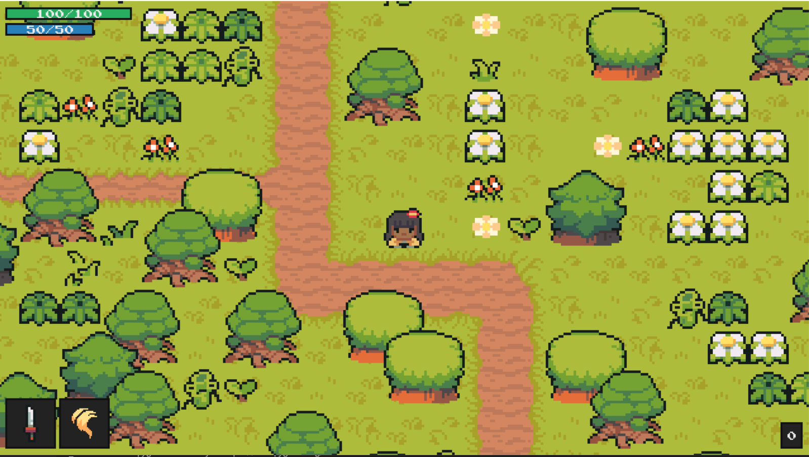

# RPG with PyGame

<p align="center">
  
</p>

## How to setup?
1. Create a Python virtual environment 

```
python -m venv .venv
```

2. Activate the virtual environment

```
.\.venv\Scripts\activate
```

3. Install the requirements

```
pip install -r requirements
```

4. Run the game

```
cd .\code\;python main.py
```

## Thanks to
A clone game of PyGame tutorial by [CC](https://github.com/clear-code-projects/Zelda)


[](https://www.youtube.com/watch?v=QU1pPzEGrqw "Blinking LEDs")
